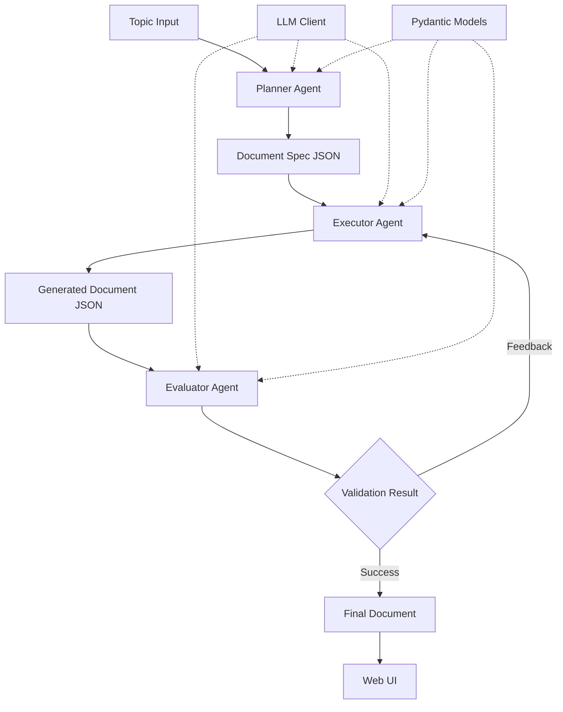

# Design Document: Vividoc System

## Overview

The Vividoc System implements a three-phase pipeline for generating interactive educational documents from topics. The system uses Google Gemini LLMs with structured output validation via Pydantic models. Each phase (Planner, Executor, Evaluator) operates independently with well-defined inputs and outputs, enabling modular execution and testing.

The design emphasizes simplicity and academic research needs: minimal error handling, clean code structure, and focus on core functionality. The system uses existing patterns from the codebase (LLMClient, Pydantic structured outputs) and extends them for the document generation workflow.

## Architecture



### Component Layers

1. **Agent Layer**: Planner, Executor, Evaluator classes
2. **Data Layer**: Pydantic models for type-safe data flow
3. **LLM Layer**: LLMClient wrapper for Gemini API calls
4. **CLI Layer**: Typer-based command interface
5. **UI Layer**: Web interface for document rendering

## Components and Interfaces

### 0. Configuration Models

**PlannerConfig**
```python
@dataclass
class PlannerConfig:
    llm_provider: str = "google"  # Configurable LLM provider
    llm_model: str = "gemini-2.5-pro"  # Configurable model
    output_path: str = "output/doc_spec.json"
```

**ExecutorConfig**
```python
@dataclass
class ExecutorConfig:
    llm_provider: str = "google"
    llm_model: str = "gemini-2.5-pro"
    max_code_fix_attempts: int = 3
    code_timeout_seconds: int = 30
    output_path: str = "output/generated_doc.json"
```

**EvaluatorConfig**
```python
@dataclass
class EvaluatorConfig:
    llm_provider: str = "google"
    llm_model: str = "gemini-2.5-pro"
    output_path: str = "output/evaluation.json"
```

**RunnerConfig**
```python
@dataclass
class RunnerConfig:
    llm_provider: str = "google"
    llm_model: str = "gemini-2.5-pro"
    output_dir: str = "output"
```

### 1. Pydantic Data Models

**KnowledgeUnitSpec Model**
```python
class KnowledgeUnitSpec(BaseModel):
    id: str
    unit_content: str
    text_description: str
    interaction_description: str
```

**DocumentSpec Model**
```python
class DocumentSpec(BaseModel):
    topic: str
    knowledge_units: List[KnowledgeUnitSpec]
```

**GeneratedKnowledgeUnit Model**
```python
class GeneratedKnowledgeUnit(BaseModel):
    id: str
    unit_content: str
    text_content: str
    interactive_code: str
    code_validated: bool
```

**GeneratedDocument Model**
```python
class GeneratedDocument(BaseModel):
    topic: str
    knowledge_units: List[GeneratedKnowledgeUnit]
```

**EvaluationFeedback Model**
```python
class EvaluationFeedback(BaseModel):
    overall_coherence: str
    component_issues: List[str]
    requires_revision: bool
```

### 2. Planner Agent

**Interface**
```python
class Planner:
    def __init__(self, config: PlannerConfig):
        self.config = config
        self.llm_client = LLMClient(config.llm_provider)
    
    def run(self, topic: str) -> DocumentSpec:
        # Generate document spec from topic
        pass
```

**Responsibilities**
- Accept topic string as input
- Call LLM with structured output schema for DocumentSpec
- Generate knowledge units with unique IDs
- Create self-contained text and interaction descriptions
- Return validated DocumentSpec

**LLM Prompt Strategy**
- Single LLM call with structured output
- Prompt includes examples of good knowledge units
- Schema enforces required fields via Pydantic

### 3. Executor Agent

**Interface**
```python
class Executor:
    def __init__(self, config: ExecutorConfig):
        self.config = config
        self.llm_client = LLMClient(config.llm_provider)
    
    def run(self, doc_spec: DocumentSpec) -> GeneratedDocument:
        # Generate text and code for each knowledge unit
        pass
    
    def generate_text(self, text_description: str) -> str:
        # Generate text content
        pass
    
    def generate_code(self, interaction_description: str) -> str:
        # Generate interactive code
        pass
    
    def validate_code(self, code: str) -> tuple[bool, str]:
        # Execute code and check for errors
        pass
    
    def fix_code(self, code: str, error: str) -> str:
        # Fix code based on error message
        pass
```

**Responsibilities**
- Process each knowledge unit sequentially
- Generate text content from text_description
- Generate interactive Python code from interaction_description
- Execute code to detect bugs
- Fix bugs using error feedback
- Return validated GeneratedDocument

**Code Execution Strategy**
- Use exec() with restricted globals for safety
- Capture stdout and stderr
- Extract exception messages for bug fixing
- Retry with fixed code (max 3 attempts)

### 4. Evaluator Agent

**Interface**
```python
class Evaluator:
    def __init__(self, config: EvaluatorConfig):
        self.config = config
        self.llm_client = LLMClient(config.llm_provider)
    
    def run(self, generated_doc: GeneratedDocument) -> EvaluationFeedback:
        # Evaluate document quality
        pass
    
    def check_coherence(self, generated_doc: GeneratedDocument) -> str:
        # Check text fluency and logical flow
        pass
    
    def check_components(self, generated_doc: GeneratedDocument) -> List[str]:
        # Verify interactive components render correctly
        pass
```

**Responsibilities**
- Validate overall text coherence
- Check logical flow between knowledge units
- Verify interactive components are valid
- Generate feedback for Executor
- Return EvaluationFeedback

**Evaluation Strategy**
- LLM call for coherence checking
- Code syntax validation for components
- Return structured feedback with specific issues

### 5. LLM Client Extension

**Enhanced Interface**
```python
class LLMClient:
    def call_structured_output(
        self, 
        model: str, 
        prompt: str, 
        schema: Type[BaseModel]
    ) -> BaseModel:
        # Call LLM with structured output
        response = self.client.models.generate_content(
            model=model,
            contents=prompt,
            config={
                "response_mime_type": "application/json",
                "response_json_schema": schema.model_json_schema()
            }
        )
        return schema.model_validate_json(response.text)
```

**Responsibilities**
- Wrap Google Gemini API calls
- Handle structured output configuration
- Validate responses against Pydantic schemas
- Return typed model instances

### 6. Pipeline Runner

**Interface**
```python
class Runner:
    def __init__(self, config: RunnerConfig):
        self.config = config
        self.planner = Planner(PlannerConfig())
        self.executor = Executor(ExecutorConfig())
        self.evaluator = Evaluator(EvaluatorConfig())
    
    def run(self, topic: str) -> GeneratedDocument:
        # Execute complete pipeline
        doc_spec = self.planner.run(topic)
        generated_doc = self.executor.run(doc_spec)
        
        feedback = self.evaluator.run(generated_doc)
        while feedback.requires_revision:
            generated_doc = self.executor.refine(generated_doc, feedback)
            feedback = self.evaluator.run(generated_doc)
        
        return generated_doc
```

**Responsibilities**
- Orchestrate three-phase pipeline
- Pass data between agents
- Handle feedback loop between Executor and Evaluator
- Save intermediate outputs

### 7. CLI Commands

**Command Structure**
```python
@app.command()
def plan(topic: str, output: str = "doc_spec.json"):
    # Run planner only
    pass

@app.command()
def exec(spec_file: str, output: str = "generated_doc.json"):
    # Run executor only
    pass

@app.command()
def eval(doc_file: str, output: str = "evaluation.json"):
    # Run evaluator only
    pass

@app.command()
def run(topic: str, output_dir: str = "output"):
    # Run complete pipeline
    pass
```

### 8. Web UI

**Technology Stack**
- Flask for backend server
- HTML/CSS/JavaScript for frontend
- Modern UI framework (e.g., Tailwind CSS) for beautiful, responsive design
- Pyodide for running Python code in browser

**UI Features**
- Beautiful, clean academic styling with modern design
- Human-in-the-loop editing: After spec generation, users can review and modify knowledge units before execution
- Interactive spec editor with inline editing capabilities
- Real-time preview of document structure
- Ability to add, remove, or reorder knowledge units
- Edit text_description and interaction_description fields directly
- Save modified specs back to JSON

**UI Structure**
```
ui/
├── app.py              # Flask server
├── templates/
│   ├── spec_editor.html    # Spec editing interface (human-in-the-loop)
│   └── document.html       # Document display template
└── static/
    ├── css/
    │   └── style.css       # Beautiful modern academic styling
    └── js/
        ├── spec_editor.js  # Spec editing functionality
        └── runner.js       # Interactive code execution
```

**Document Rendering**
- Load GeneratedDocument JSON
- Render text content with beautiful academic styling
- Execute interactive code using Pyodide
- Display visualizations inline with text
- Smooth transitions and animations for better UX

## Data Models

### File Storage Format

**Document Spec (doc_spec.json)**
```json
{
  "topic": "What is π?",
  "knowledge_units": [
    {
      "id": "ku1",
      "unit_content": "Brief summary",
      "text_description": "Detailed description for text generation",
      "interaction_description": "Description for code generation"
    }
  ]
}
```

**Generated Document (generated_doc.json)**
```json
{
  "topic": "What is π?",
  "knowledge_units": [
    {
      "id": "ku1",
      "unit_content": "Brief summary",
      "text_content": "Generated educational text...",
      "interactive_code": "import matplotlib.pyplot as plt\n...",
      "code_validated": true
    }
  ]
}
```

**Evaluation Feedback (evaluation.json)**
```json
{
  "overall_coherence": "Text flows well between units...",
  "component_issues": ["ku2: Code missing import statement"],
  "requires_revision": false
}
```

## Correctness Properties

*A property is a characteristic or behavior that should hold true across all valid executions of a system—essentially, a formal statement about what the system should do. Properties serve as the bridge between human-readable specifications and machine-verifiable correctness guarantees.*


### Property 1: Document Spec Completeness
*For any* topic string input to the Planner, the generated DocumentSpec should contain at least one knowledge unit, and each knowledge unit should have non-empty id, unit_content, text_description, and interaction_description fields.

**Validates: Requirements 1.1, 1.3**

### Property 2: Knowledge Unit ID Uniqueness
*For any* DocumentSpec, all knowledge unit IDs should be unique within that document.

**Validates: Requirements 1.2**

### Property 3: Pydantic Model Serialization Round-Trip
*For any* valid Pydantic model instance (DocumentSpec, GeneratedDocument, EvaluationFeedback), serializing to JSON with model_dump_json and then deserializing with model_validate_json should produce an equivalent object.

**Validates: Requirements 1.6, 5.5, 5.6**

### Property 4: Executor Output Completeness
*For any* DocumentSpec input to the Executor, the output GeneratedDocument should have the same number of knowledge units, and each generated knowledge unit should have non-empty text_content and interactive_code fields.

**Validates: Requirements 2.1, 2.2, 2.3, 2.6**

### Property 5: Code Validation State Consistency
*For any* GeneratedDocument, if a knowledge unit has code_validated set to true, then the interactive_code field should contain syntactically valid Python code that can be parsed without errors.

**Validates: Requirements 2.4, 2.8, 10.6**

### Property 6: Evaluator Feedback Completeness
*For any* EvaluationFeedback where requires_revision is true, the component_issues list should be non-empty, providing specific feedback about what needs revision.

**Validates: Requirements 3.4**

### Property 7: Evaluation Coverage
*For any* GeneratedDocument input to the Evaluator, the evaluation process should check all knowledge units in the document.

**Validates: Requirements 3.3**

### Property 8: LLM Client Type Safety
*For any* Pydantic model schema passed to call_structured_output, the returned object should be an instance of that exact model type.

**Validates: Requirements 4.5, 4.6**

### Property 9: File Persistence Round-Trip
*For any* agent output (DocumentSpec, GeneratedDocument, EvaluationFeedback), saving to a JSON file and then loading from that file should produce an equivalent object validated against the correct Pydantic model.

**Validates: Requirements 9.1, 9.2, 9.3, 9.4, 9.5**

### Property 10: Code Execution Error Capture
*For any* Python code string that raises an exception when executed, the execution system should capture the exception message and type without crashing the parent process.

**Validates: Requirements 10.3**

## Error Handling

The system follows a minimal error handling approach suitable for academic research:

### LLM Call Failures
- Network errors: Log and re-raise
- Invalid API responses: Log raw response and re-raise
- Schema validation failures: Log validation errors and re-raise

### Code Execution Failures
- Syntax errors: Capture and pass to bug-fixing loop
- Runtime errors: Capture exception message and stack trace
- Timeout errors: Kill execution after 30 seconds

### File I/O Failures
- Missing files: Log file path and re-raise FileNotFoundError
- Invalid JSON: Log file path and re-raise JSONDecodeError
- Permission errors: Log file path and re-raise PermissionError

### Pipeline Failures
- Agent failures: Log phase name and error, halt pipeline
- Validation failures: Log validation errors, halt pipeline
- No error recovery or retry logic (fail fast for debugging)

## Testing Strategy

The Vividoc System uses a dual testing approach combining unit tests for specific examples and property-based tests for universal correctness properties.

### Property-Based Testing

**Library**: Use Hypothesis for Python property-based testing

**Configuration**:
- Minimum 100 iterations per property test
- Each test tagged with: **Feature: vividoc-system, Property N: [property text]**
- Custom generators for Pydantic models using hypothesis-jsonschema

**Property Test Coverage**:
- Property 1: Generate random topics, verify DocumentSpec completeness
- Property 2: Generate random DocumentSpecs, verify ID uniqueness
- Property 3: Generate random model instances, verify serialization round-trip
- Property 4: Generate random DocumentSpecs, verify Executor output completeness
- Property 5: Generate random GeneratedDocuments, verify code validation consistency
- Property 6: Generate random EvaluationFeedback with requires_revision=true, verify feedback presence
- Property 7: Generate random GeneratedDocuments, verify all units are evaluated
- Property 8: Generate random Pydantic schemas, verify type safety
- Property 9: Generate random agent outputs, verify file persistence round-trip
- Property 10: Generate random Python code with errors, verify error capture

### Unit Testing

**Unit Test Focus**:
- Specific examples from requirements (e.g., "What is π?" test case)
- Edge cases (empty topics, single knowledge unit, no interactive code)
- Integration between agents (pipeline data flow)
- CLI command registration and argument parsing
- Error conditions (invalid JSON, malformed code, LLM failures)

**Test Organization**:
```
tests/
├── test_planner.py          # Planner agent tests
├── test_executor.py         # Executor agent tests
├── test_evaluator.py        # Evaluator agent tests
├── test_llm_client.py       # LLM client tests
├── test_models.py           # Pydantic model tests
├── test_pipeline.py         # End-to-end pipeline tests
├── test_cli.py              # CLI command tests
└── properties/
    ├── test_property_1.py   # Property 1: Document Spec Completeness
    ├── test_property_2.py   # Property 2: ID Uniqueness
    ├── test_property_3.py   # Property 3: Serialization Round-Trip
    ├── test_property_4.py   # Property 4: Executor Completeness
    ├── test_property_5.py   # Property 5: Code Validation
    ├── test_property_6.py   # Property 6: Feedback Completeness
    ├── test_property_7.py   # Property 7: Evaluation Coverage
    ├── test_property_8.py   # Property 8: Type Safety
    ├── test_property_9.py   # Property 9: File Persistence
    └── test_property_10.py  # Property 10: Error Capture
```

### Testing Balance

- Property tests handle comprehensive input coverage through randomization
- Unit tests focus on specific examples, edge cases, and integration points
- Both are complementary: unit tests catch concrete bugs, property tests verify general correctness
- Avoid excessive unit tests for cases already covered by properties
- Focus unit tests on business logic and integration, not exhaustive input combinations
