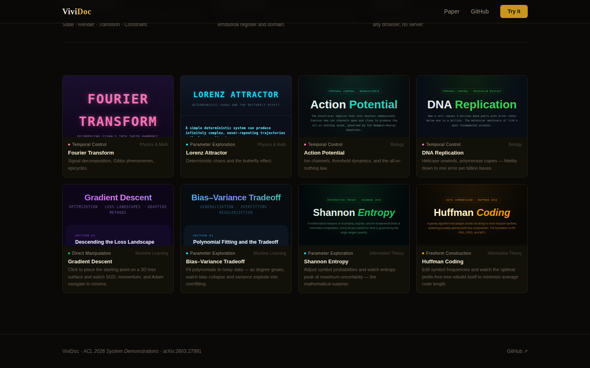

<div align="center">

<h1>ViviDoc</h1>
<p><strong>Turn any topic into an explorable explanation.</strong></p>

[](https://arxiv.org/abs/2603.27991)
[](https://arxiv.org/abs/2603.27991)
[](https://python.org)
[](LICENSE)
[](https://vividoc.vercel.app)

**[Live Demo](https://vividoc.vercel.app)** · **[Paper (arXiv)](https://arxiv.org/abs/2603.27991)** · **[PDF](assets/paper.pdf)** · **[Quick Start](#-quick-start)**

<br/>



</div>

---

## What is ViviDoc?

ViviDoc is an LLM-powered pipeline that generates **self-contained interactive HTML documents** — explorable explanations — from a single topic input. Given a topic, ViviDoc designs a purpose-built visual style, plans a structured document using the **SRTC Interaction Spec**, and writes a single HTML file with explanatory text, KaTeX math, and interactive Canvas visualizations that open in any browser with no server.

The key insight is the **SRTC specification** — a four-field interaction design language (State · Render · Transition · Constraint) that separates *what the learner should discover* from *how it's rendered*. This allows an LLM to reason about pedagogy before touching code.

> **Accepted at ACL 2026 System Demonstrations** — [arXiv:2603.27991](https://arxiv.org/abs/2603.27991)

---

## ✨ Features

- **Zero-dependency output** — Each document is a single `.html` file with embedded CSS and JS. No build step, no server. Open it in a browser.
- **Purpose-built visual style** — ViviDoc reasons about the topic's emotional register and domain conventions (physics → monospace + dark; biology → organic + warm) to synthesize a custom visual identity per document.
- **Structured interaction design** — The SRTC spec (State · Render · Transition · Constraint) grounds every visualization in a pedagogical invariant — the one thing the learner must discover.
- **8 interaction categories** — Grounded in empirical analysis of 482 interaction instances across 101 real-world explorable explanations (ViviBench).
- **Two usage modes** — Interactive Claude Code skill (`/vividoc`) for zero-setup generation, or CLI pipeline for batch generation and benchmarking.
- **Extensible template library** — Add reference cases with `/vividoc-learn <url>` to distill real explorable explanations into reusable SRTC templates.

---

## 🚀 Quick Start

### Option A: Claude Code skill (recommended — zero setup)

Open this repository in [Claude Code](https://claude.ai/code). No API key needed — Claude Code is the model.

```
/vividoc Fourier Transform
```

Claude Code reasons about the topic, proposes a visual style, designs SRTC interactions, and writes the document directly. Output: `outputs/fourier_transform/document.html`

```
/vividoc-learn https://ncase.me/trust/
```

Fetches the page, extracts its interaction patterns and visual style into SRTC format, and saves a reusable template to `benchmark/datasets/interaction_examples/`.

### Option B: CLI pipeline

```bash
# Install
pip install uv && uv sync

# Set API key (OpenRouter covers most models)
export OPENROUTER_API_KEY="sk-or-..."

# Generate a document
vividoc run "Fourier Transform" openrouter/google/gemini-2.5-pro
# → outputs/fourier_transform/vividoc_gemini-2.5-pro/document.html

# Stage-by-stage
vividoc plan "Fourier Transform" openrouter/google/gemini-2.5-pro -o spec.json
vividoc exec spec.json openrouter/google/gemini-2.5-pro

# With style guidance
vividoc run "Fourier Transform" openrouter/google/gemini-2.5-pro \
  --text-style "Conversational, concrete analogies" \
  --interaction-style "Dark background, neon accents, physics aesthetic"
```

Supported models: any `openrouter/<provider>/<model>` string, or `anthropic/claude-*` with `ANTHROPIC_API_KEY`.

---

## 🧠 How It Works

ViviDoc decomposes document generation into three stages:

```
Topic (string)
    │
    ▼  Plan
┌─────────────────────────────┐
│  Planner                    │
│  LLM → DocumentSpec         │  spec.json
│  (SRTC per knowledge unit)  │
└─────────────┬───────────────┘
              │
    ▼  Execute (per section)
┌─────────────────────────────┐
│  Executor                   │
│  Stage 1: text + KaTeX      │  HTML fragments
│  Stage 2: JS + Canvas viz   │
└─────────────┬───────────────┘
              │
    ▼  Evaluate
┌─────────────────────────────┐
│  Evaluator                  │
│  Coherence + render check   │  document.html
└─────────────────────────────┘
```

### The SRTC Interaction Spec

Every knowledge unit has an `interaction_spec` with four fields:

| Field | Role |
|---|---|
| **S** (State) | Variables the user controls or that are derived |
| **R** (Render) | List of visual elements to display |
| **T** (Transition) | Cause → effect rules (`[]` = static, no interaction needed) |
| **C** (Constraint) | The pedagogical invariant the learner must discover |

The constraint is the design target: *every* visual element should be built to make it unmissable.

**Interaction is not mandatory.** If `T = []`, the executor creates a beautiful static or auto-animated visualization — static is sometimes the right answer.

---

## 🎛️ Interaction Taxonomy

ViviDoc's interaction design is grounded in **482 interaction instances** across **101 real-world explorable explanations** from 63 websites and 11 domains (ViviBench dataset):

| # | Category | When to use | Example |
|---|----------|-------------|---------|
| 1 | **Parameter Exploration** | Continuous variable has a nonlinear effect | Lorenz Attractor — σ, ρ sliders |
| 2 | **State Switching** | Discrete modes produce qualitatively different results | Quantum Orbitals — 1s / 2p / 3d |
| 3 | **Direct Manipulation** | Dragging objects; spatial relationships are the concept | Geometric Optics — drag lens/object |
| 4 | **Freeform Construction** | Build structure to observe emergent behavior | Neural Network — click-to-place neurons |
| 5 | **Temporal Control** | Concept has a time dimension; play/pause/scrub | Fourier Epicycles — play + harmonic slider |
| 6 | **Inspection** | Spatial structure revealed by hovering | Voronoi — hover highlights cell |
| 7 | **Spatial Navigation** | Inherently 3D; rotate/pan/zoom | Möbius Strip — drag to rotate 3D mesh |
| 8 | **Scroll-driven Narrative** | Linear progression reveals the concept | Entropy — scroll removes wall, particles mix |

Reference implementations (self-contained HTML + SRTC spec + style guide) for all 8 categories: [`benchmark/datasets/interaction_examples/`](benchmark/datasets/interaction_examples/)

---

## 📚 Showcase

**[→ Browse all documents at vividoc.vercel.app](https://vividoc.vercel.app)**

10 hand-verified documents across 5 domains, each generated by ViviDoc and reviewed for pedagogical accuracy:

| Document | Domain | Interaction | Key Concept |
|---|---|---|---|
| [Fourier Transform](https://vividoc.vercel.app) | Physics & Math | Temporal Control | Epicycles, Gibbs phenomenon, signal decomposition |
| [Lorenz Attractor](https://vividoc.vercel.app) | Physics & Math | Parameter Exploration | Sensitive dependence, strange attractor, butterfly effect |
| [Action Potential](https://vividoc.vercel.app) | Biology | Temporal Control | Hodgkin-Huxley ion channels, all-or-nothing threshold |
| [DNA Replication](https://vividoc.vercel.app) | Biology | Temporal Control | Helicase, polymerase fidelity, Okazaki fragments |
| [Gradient Descent](https://vividoc.vercel.app) | Machine Learning | Direct Manipulation | Loss landscapes, optimizers (SGD/Adam), learning rate |
| [Bias–Variance Tradeoff](https://vividoc.vercel.app) | Machine Learning | Parameter Exploration | Overfitting, regularization, model complexity |
| [Shannon Entropy](https://vividoc.vercel.app) | Information Theory | Parameter Exploration | Information content, source coding theorem |
| [Huffman Coding](https://vividoc.vercel.app) | Information Theory | Freeform Construction | Prefix-free codes, optimal compression, entropy bound |
| [Supply & Demand](https://vividoc.vercel.app) | Economics | Direct Manipulation | Equilibrium, elasticity, deadweight loss |
| [Black–Scholes](https://vividoc.vercel.app) | Economics | Parameter Exploration | Option pricing, the Greeks, IV smile |

---

## 🗂️ Repository Structure

```
.claude/commands/        # Claude Code skills: /vividoc and /vividoc-learn
prompts/                 # LLM prompt templates (planner, executor, evaluator, styler, video)
vividoc/
├── core/                # Pipeline stages: planner, executor, evaluator, runner, styler
│   ├── video_codegen.py # Video generation: DocumentSpec → Manim scenes
│   └── narration_gen.py # Narration synthesis from SRTC T-field keyframes
├── utils/llm/           # LLM client + provider adapters (OpenRouter, Anthropic)
└── cli.py               # CLI entry points (run, plan, exec, eval, video)
benchmark/
├── datasets/
│   ├── interaction_examples/   # 8 reference cases (HTML + SRTC spec + style guide)
│   └── prepped/                # ViviBench — 101-topic evaluation dataset
├── baselines/                  # AutoGen, CAMEL, MetaGPT, naive baselines
└── evals/                      # Automated evaluation scripts
frontend/                # React showcase (vividoc.vercel.app)
docs/                    # Design docs, video generation roadmap
examples/                # Standalone demos (Manim video generation)
```

---

## 🔬 Development

```bash
uv sync --dev

# Run tests
uv run pytest

# Lint
uv run ruff check . && uv run ruff format .

# Run benchmark evaluation
uv run python benchmark/run.py

# Serve showcase locally
cd frontend && npm install && npm run dev
```

### Adding a new LLM provider

1. Create `vividoc/utils/llm/callers/<provider>_caller.py` implementing `LLMCaller`
2. Register it in `vividoc/utils/llm/caller_registry.py`

### Adding a reference case

```
/vividoc-learn https://example.com/interactive-page my-case-name
```

Saves to `benchmark/datasets/interaction_examples/my-case-name/` with SRTC spec, HTML, and style notes. Immediately available as a template for future `/vividoc` runs.

---

## 📄 Citation

If you use ViviDoc in your research, please cite:

```bibtex
@inproceedings{tang2026vividoc,
  title     = {{ViviDoc}: Generating Interactive Documents through Human-Agent Collaboration},
  author    = {Tang, Yinghao and Xie, Yupeng and Feng, Yingchaojie and Lan, Tingfeng and Lao, Jiale and Cheng, Yue and Chen, Wei},
  booktitle = {Proceedings of the 64th Annual Meeting of the Association for Computational Linguistics: System Demonstrations},
  year      = {2026},
  url       = {https://arxiv.org/abs/2603.27991}
}
```

---

<div align="center">

MIT License · [ACL 2026 System Demonstrations](https://arxiv.org/abs/2603.27991) · [arXiv:2603.27991](https://arxiv.org/abs/2603.27991)

</div>
